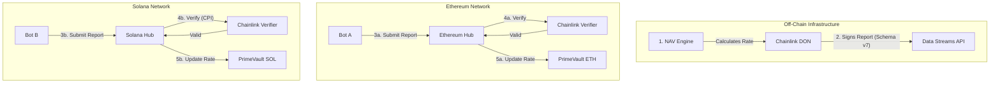

# ChainLink <> Hastra Design (External)

a **"Symmetric Hub" architecture** (where both chains trust the Off-Chain Oracle)

In this design, **neither chain is the master.** The "Master" is your off-chain calculation engine, and Chainlink is the secure courier that delivers that truth to both chains identically.

| **Component** | **Who writes/runs it?** | **What is it?** |
| --- | --- | --- |
| **The DON** | **Chainlink** | A network of secure nodes that fetch data, reach consensus, and sign it off-chain. |
| **The Verifier** | **Chainlink** | A pre-deployed smart contract on-chain that contains the public keys of the DON. It checks if signatures are real. |
| **The Consumer** | FigureMarkets | FigureMarkets "Hub" contract. It receives the opaque "report blob," passes it to the Verifier, and makes sure that the exchangeRate is available for onchain operations. |

example verification contracts 

EVM —> [https://docs.chain.link/data-streams/tutorials/evm-onchain-report-verification](https://docs.chain.link/data-streams/tutorials/evm-onchain-report-verification)

SVM —> https://docs.chain.link/data-streams/tutorials/solana-onchain-report-verification

### Flow Summary

1. **Off-Chain:** NAV engine calculates the exchangeRate  `Exchange Rate = 1.3333333`.
2. **Chainlink:** Captures this and generates a **Signed Report**.
3. **Bot:** Sees the new report in the API.
4. **Bot Action 1:** Sends TX to Ethereum `HastraHubETH.updateRate(report)`.
5. **Bot Action 2:** Sends TX to Solana `hastra_hub.update_rate(report)`.
6. **Result:** Both chains verify the *exact same* source data independently using their local Chainlink Verifiers.

## Overview

**Pattern:** Symmetric Hub & Spoke 
 Propagate the off-chain NAV (Net Asset Value) to both Ethereum and Solana with identical security guarantees.

- **The Source:** The Hastra Calculation Engine computes the rate off-chain.
- **The Witness:** The Chainlink DON (Decentralized Oracle Network) signs this data, creating a tamper-proof "Report."
- **The Hubs:** Smart contracts on **both** Ethereum and Solana verify this report independently.
- **The Result:** `PrimeVault (ETH)` and `PrimeVault (SOL)` hold the exact same exchange rate, secured by the same oracle network.

## Component Breakdown (Not in any specific order)

### Off-Chain: The Replicator (Bot)

The Replicator is a lightweight, stateless automation service ) responsible for "bridging" the signed data to your on-chain Hubs. It does not decide the price; it merely delivers the sealed envelope.

- **Role:** The MiddleWare.
- **Trigger Strategy:** **Event-Driven.**
    1. **Monitor:** Listens for the "Report Generated" signal from the Chainlink Data Streams API (corresponding to your off-chain NAV update).
    2. **Fetch:** Downloads the **Signed Report (Schema v7)** payload.
    3. **Broadcast (Atomic-ish):** Submits two parallel transactions:
        - **Tx A (Ethereum):** Calls `HastraHub.updateRate(report)`
        - **Tx B (Solana):** Calls `hastra_hub::update_rate(report)`
- **Key Responsibility:**
    - **Gas Management:** Holds ETH and SOL to pay for the "push" transactions.
    - **Fee Management:** Ensures the Hub contracts have enough native tokens to pay the Chainlink Verifier.
    - **Resiliency:** Retries transactions if one chain is congested, ensuring eventual consistency between ETH and SOL.

### The Hubs (On-Chain Verification)

The "Hubs" are the gatekeepers. They are the *only* contracts in your system authorized to write the global exchange rate. They act as a firewall, rejecting any data that lacks a valid signature from the Chainlink DON.

### Ethereum Hub (`HastraHub.sol`)

A Consumer Contract deployed on Ethereum Mainnet.

- **Function:** Acts as the "getExchangeRate" provider for the Ethereum `PrimeVault`.
- **Workflow:**
    1. Receives the opaque `report` bytes from the Bot.
    2. Calls the **Chainlink Verifier Proxy** (on-chain).
    3. **PAYMENT:** Pays the verification fee (in ETH).
    4. **VERIFICATION:** Confirms the report signatures are valid and the timestamp is fresh.
    5. **STORAGE:** Updates the public `int192 currentExchangeRate` variable.
- **Security:** `PrimeVault` reads from this contract. Since the Hub enforces verification, the Vault is protected from admin key compromise.

### Solana Hub (`hastra_hub` Program)

An Anchor Program deployed on Solana.

- **Function:** Acts as the "getExchangeRate" provider for the Solana `PrimeVault`.
- **Workflow:**
    1. Receives the `report` bytes via instruction data.
    2. Invokes the **Chainlink Verifier Program** via CPI (Cross-Program Invocation).
    3. **PAYMENT:** Transfers the verification fee (token) to the Verifier Program.
    4. **VERIFICATION:** Validates the Ed25519 signatures from the DON.
    5. **STORAGE:** Serializes the result into the `GlobalRateConfig` PDA (Program Derived Address).
- **Access:** The data is stored in a standard Solana account, making it "free" for all your Solana pools to read during their own transactions.